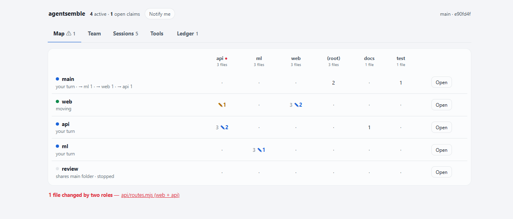

# agentsemble

**저장소를 Claude Code 창 여러 개로 나눠 맡기고 — 팀 전체를 한 지도에서 실시간으로 봅니다.**

[English](README.md)



판은 **팀이 일하는 동안의** 프로젝트 구조를 그립니다:

- 저장소의 **어느 부분을 누가 맡았는지**, 창마다 **실제로 무엇을 바꿨는지**(자기 가지 + 아직 커밋 안 한 것)
- **맡지 않은 파일을 건드린 것**(주황 ✎)과 **두 창이 같은 파일을 바꾼 것**(빨강 ●) — 합치다 싸우기 전에
- **누가 누구에게 지시했는지**, 창마다 움직이는 중인지 · 내 차례인지 · 멈췄는지
- 역할 옆 **Open** 을 누르면 그 터미널 창이 앞으로 옵니다 — 닫혀 있으면 `claude --resume` 으로 다시 엽니다(Windows)

전부 이 PC 의 git 과 Claude Code 기록에서 읽습니다. 밖으로 나가는 것은 없습니다.

## 설치

Claude Code 에서:

```
/plugin marketplace add havanafrog/agentsemble
/plugin install agentsemble@agentsemble
```

Node 20 이상과 git 이 필요합니다(설치만 하면 됩니다 — 폴더가 아직 git 저장소가 아니면
`/agentsemble` 이 만들어 주고 첫 커밋까지 해 줍니다). npm 패키지는 없습니다.

agentsemble 은 Claude Code 플러그인입니다. 저장소에서 `/agentsemble` 을 부르면 Claude 가 과제를
읽고 팀을 제안합니다 — **main** 창 하나와 **서브** 창 2~4개, 서브마다 자기 git worktree 와 자기
스킬·플러그인을 가집니다. 승인하면 그대로 꾸립니다. 로컬 판에서 누가 무엇을 하는지, 창마다
걸려야 할 도구가 걸렸는지, 만드는 쪽·재는 쪽 장부를 봅니다.

실제 과제를 이렇게 굴리다 나온 도구입니다: 일을 쪼개 지시하고 결과를 직접 확인해 합치는 main,
화면 창, 모델 학습 창.

## 빠른 시작

```
/agentsemble
```

1. Claude 가 저장소(README, 폴더, 빌드·테스트 명령, 최근 커밋, 설치된 플러그인·스킬)를 읽고
   몇 줄로 요약합니다. 틀리면 고쳐 주세요.
2. 팀 표를 제안합니다 — 역할마다 할 일, 건드리지 않을 것, 맡는 파일, 작업칸과 브랜치,
   **이미 설치된** 스킬·플러그인 중 무엇을 걸지. **여기서 멈추고 승인을 기다립니다.**
3. 승인하면 `agents.json` 을 쓰고, 작업칸을 만들고, 역할마다 스킬과 플러그인 켜고 끄기를 겁니다.
4. 서브 역할마다 창을 엽니다 (`cd ../<저장소>-team/<역할> && claude` 뒤 `/rename <역할>`).
5. 판을 띄웁니다:

```
node "<플러그인 폴더>/bin/board.mjs"      →  http://127.0.0.1:8740
```

## 하는 것과 안 하는 것

- **아무것도 설치하지 않습니다.** 스킬은 이미 가진 것(`~/.claude/skill-store`, `~/.claude/skills`)
  에서 고릅니다. 없는 도구는 `wishlist` 에 적습니다.
- **창을 대신 열지 않습니다.** 터미널·IDE 가 제각각이라 사람이 열고 이름을 붙입니다.
- **팀 표를 승인하기 전에는 꾸리지 않습니다.**
- **다른 설정은 건드리지 않습니다.** 작업칸 `.claude/settings.local.json` 의 `enabledPlugins`
  만 씁니다.

## 판
**과제와 프로젝트.** `agents.json` 의 역할에 `"task"` 를 주면 판 맨 위에 그 과제 탭이 따로 생깁니다
(main 은 모든 탭의 맨 위). `"$title"` 은 프로젝트 탭 이름입니다. 판 하나로 저장소 여럿을 볼 수도
있습니다: `board.mjs --also ../다른-저장소` 마다 탭이 하나씩. 오른쪽 위 종과 탭의 빨간 숫자는 나를
기다리는 창 수입니다.

탭 넷: **Map**(위 그림 — main 이 위, 역할마다 카드: 창이 하는 일, 받은 마지막 지시, 맡은 영역과 지금 고치는 것), **Sessions**(창마다 최근 동작, 누르면
대화), **Tools**(역할마다 계획 대 실제 — `missing`·`+` 로 어긋남 표시), **Ledger**(열린 주장이 위,
끝난 것은 접힘).

Map 의 역할이나 창 카드를 누르면 옆 칸에 **Conversation**(대화)과 **Changes**(바꾼 파일과 변경 내용 —
자기 가지 대 main + 아직 커밋 안 한 것)가 열립니다. 빨간 충돌을 누르면 두 역할이 그 파일을 어떻게
바꿨는지 위아래로 보여 줍니다. 마지막으로 열어 본 뒤 새 말이 생긴 창엔 파란 점이 찍히고, 창이
일을 마치고 *내 차례*가 되면 오른쪽 아래에 카드가 뜹니다(탭이 가려져 있으면 종에서 허락한 PC 알림으로). 오른쪽
위 종은 기다리는 창 수를 세고, 누르면 목록이 나옵니다.

> **판에는 대화 기록이 통째로 보입니다.** 127.0.0.1 에서만 듣습니다. `--host` 로 바꾸면 경고를
> 찍습니다 — 밖에 열지 마세요.

`~/.claude/projects/…` 기록과 `~/.claude/sessions` 를 읽기만 하고, 아무것도 쓰지 않습니다.

## agents.json

```json
{
  "main": { "dir": ".", "what": "쪼개고, 확인하고, 합친다", "model": "opus" },
  "ui": {
    "dir": "../myapp-team/ui", "branch": "agent/ui",
    "what": "화면", "not": "서버 API", "owns": ["web/"],
    "skills": ["taste"],
    "plugins": { "superpowers@claude-plugins-official": true },
    "model": "sonnet", "autonomy": "build"
  },
  "review": { "shared": true, "what": "남의 작업을 읽고 확인", "model": "opus" },
  "wishlist": ["브라우저로 재는 스킬"]
}
```

파일을 고치는 역할만 폴더를 받습니다. 읽기만 하는 역할(검토, 조사)은 `"shared": true` —
main 폴더에서 main 의 도구로 엽니다.

`model` 은 창의 모델(main·검증 역할은 가장 센 것, 구현은 중간, 지켜보기만 하면 가벼운 것),
`autonomy` 는 확인받기 전 어디까지 하는지: `ask`(계획부터 보여 줌) · `build`(기본: 고치고
시험하고 커밋한 뒤 보고) · `run`(점검이 통과할 때까지 알아서 반복).

커밋해 두세요 — 팀 구성도 코드처럼 내력이 남아야 합니다. 스키마: `agents.schema.json`.

## 명령

| | |
|---|---|
| `/agentsemble` | 파악 → 제안 → 꾸리기 → 창 열기 안내 → 운영 규칙 |
| `/agentsemble status` | 역할마다 계획 대 실제 (`bin/status.mjs`, 어긋나면 exit 1) |
| `node bin/inventory.mjs` | 설치된 플러그인(켜짐/꺼짐, 딸린 스킬)과 내 스킬 목록 |
| `/agentsemble add <역할>` | 역할 하나 더 |
| `/agentsemble board` | 판 띄우기 |
| `/agentsemble verify` · `claim` · `claims` · `send` | `ops/ledger.jsonl` 장부 (만드는 쪽·재는 쪽) |

## 나누지 말아야 할 때

창이 많아지면 전체 토큰은 늡니다 — 창마다 고정비가 있고, 서브는 main 이 이미 읽은 파일을 다시
읽습니다. 대신 동시에 진행되고 main 맥락이 가벼워집니다. 30분 안에 끝날 일은 혼자 하세요.

## 개발

```
node test/run.mjs
```

모든 모듈에 자체 점검이 있습니다: `node test/run.mjs`. Windows·macOS·Linux 용 GitHub Actions 설정은 `docs/ci.yml.example` 에 있습니다.

## 라이선스

MIT
